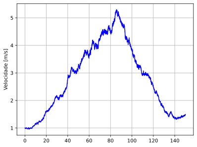
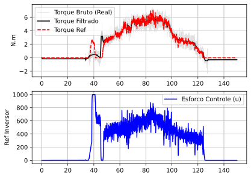
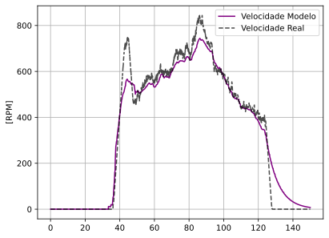
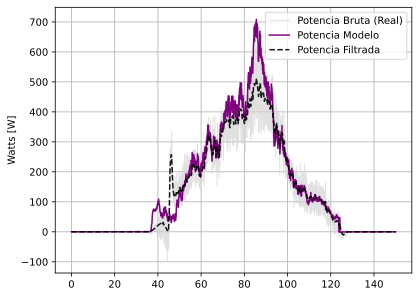
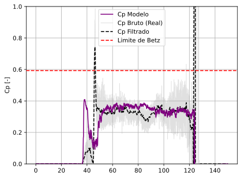
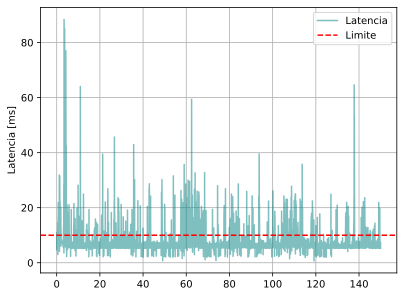

-----

# Emulador de Turbina Eólica: Bancada de Ensaios em Tempo Real (`Emulador-Eolico-Python-Completo`)

-----

## Visão Geral

O projeto `Emulador-Eolico-Python-Completo` é um ecossistema de software em Python projetado para transformar uma bancada de motores em um **Emulador de Turbina Eólica de Alta Fidelidade**. Ele e composto por um modelo matemático dinâmico de uma turbina eólica (Gêmeo Digital) e um hardware físico integrados através de comunicação serial em tempo real. 

O sistema permite a emulação de diferentes perfis de vento e o estudo do comportamento mecânico e elétrico de aerogeradores, abstraindo a complexidade do controle de hardware e da integração numérica para o pesquisador.

-----

## Contexto de Utilização no Projeto

No âmbito da pesquisa de microrredes, este software atua como o núcleo de processamento de uma bancada HIL (*Hardware-in-the-loop*). Ele utiliza o driver do inversor **WEG CFW11** para acionar o motor de indução e a biblioteca de leitura do **transdutor de torque T25 (Interface Inc)** para fechar o loop de controle. 

A lógica implementada garante que o torque medido no eixo físico siga o torque calculado pelo modelo aerodinâmico virtual, permitindo testes de algoritmos de **MPPT** e análise de dinâmica de carga com precisão laboratorial.

-----

## Drivers de Comunicação e Integração de Hardware

A robustez da emulação depende da integração direta com os componentes físicos através de drivers de baixo nível desenvolvidos especificamente para este protocolo:

### 1. Driver do Inversor de Frequência (`LCINVfunctions`)
* **Hardware:** WEG CFW11.
* **Papel no Projeto:** Atua como o **atuador** do sistema. O driver converte as referências de velocidade angular calculadas pelo modelo virtual em telegramas de bytes (baseados em STX/ETX e BCC) que o inversor compreende.
* **Uso:** É utilizado para enviar comandos de *setpoint* de velocidade e monitorar o status de operação do motor que simula o rotor eólico.

### 2. Driver do Transdutor de Torque (`LCTSfunctions`)
* **Hardware:** Interface Inc. T25 (ou Lorenz Messtechnik).
* **Papel no Projeto:** Atua como o **sensor de feedback**. Ele realiza a leitura em tempo real do torque e do RPM efetivos no eixo da bancada.
* **Uso:** O driver abstrai o protocolo proprietário de telegramas binários, entregando valores decimais limpos para o controlador PID, permitindo o ajuste dinâmico da carga e a verificação da potência mecânica real.

-----

## Funcionalidades Implementadas

### 1. Núcleo de Simulação Digital
* **Solução Numérica RK4**: Implementação do método de Runge-Kutta de 4ª ordem para integração das equações diferenciais de velocidade e corrente de armadura.
* **Modelo de Coeficiente de Potência ($C_p$)**: Suporte a dois modelos matemáticos de eficiência aerodinâmica baseados em $\lambda$ (Tip-Speed Ratio).
* **Dinâmica de Transmissão**: Modelagem incluindo inércia da turbina, inércia do gerador, relação de caixa de engrenagens, parametros eletricos do gerador e coeficientes de atrito dinâmico.

### 2. Sincronização HIL e Multimalhas de Tempo
* **Multimalhas de Tempo**: O sistema opera com duas malhas temporais distintas e sincronizadas: uma Malha Digital (20ms), responsável por resolver a física da turbina via Runge-Kutta, e uma Malha de Hardware (1ms), dedicada à comunicação serial e controle de torque.
* **Sincronização HIL**: A estratégia de tempo real é garantida pelo uso de cronômetros de alta precisão que gerenciam o thread principal, assegurando que o processamento matemático e as chamadas de I/O (inversor e torquímetro) ocorram dentro de janelas temporais fixas, evitando o acúmulo de atrasos (jitter) e garantindo o determinismo necessário para a emulação HIL.

### 3. Interface e Logs
* **Auto-Detecção Serial**: Varredura automática de portas COM para facilitar a conexão dos dispositivos.
* **Logger de Dados**: Registro otimizado com `numpy` de todas as variáveis (Torque, RPM, Potência e Erro).
* **Visualização Dinâmica**: Plotagem em tempo real de Referência vs. Medição Real via `matplotlib`.
* * **Monitoramento de Latência**: Medição contínua da latência da comunicação serial para garantir a integridade da malha de controle HIL.

-----

## Estratégias de Controle e Soft-Start

Para garantir a integridade mecânica da bancada e a fidelidade da emulação, o sistema utiliza malhas de controle avançadas e rotinas de segurança:

### 1. Rotina de Soft-Start
Antes de iniciar a emulação dinâmica, o sistema executa um procedimento de **Soft-Start**. Esta etapa acelera o motor de forma controlada e gradual até a condição de operação inicial, evitando picos de corrente e sobrecarga mecânica (trancos) no acoplamento e no torquímetro. A emulação só é liberada após a estabilização das variáveis de estado.

### 2. Malhas de Controle (Seguimento de Torque)
O núcleo do emulador opera em malha fechada para garantir que o hardware físico se comporte como a turbina virtual:
* **Feedback em Tempo Real:** O torque real medido pelo sensor T25 é comparado instantaneamente com o torque calculado pelo modelo matemático.
* **Compensação Dinâmica:** O erro entre o torque virtual e o real é processado pelo controlador PID, que ajusta a referência enviada ao inversor CFW11.
* **Anti-Windup:** Como o inversor possui limites físicos de atuação, o controle utiliza integração condicional (Anti-Windup) para evitar que o erro acumulado cause instabilidade ou sobressinal excessivo.

-----

## Estrutura do Repositório

| Arquivo | Função Principal |
| :--- | :--- |
| `main.py` | Orquestrador do loop principal, interface gráfica e logs. |
| `driver_inversor_cfw11.py` | Driver de comunicação com o inversor WEG. |
| `driver_torquimetro.py` | Driver de comunicação com o sensor de torque T25. |
| `modelo_aerogerador.py` | Motor de física da turbina e do gerador elétrico. |
| `pid_module.py` | Lógica de controle PID com proteção de saturação. |
| `init_serial_devices.py` | Utilitário de inicialização de portas seriais. |
| `parametros.py` | Definição de constantes físicas, tempos de amostragem e configurações da bancada. |

-----

## Resultados de Emulação e Análise Crítica

Abaixo estão os resultados obtidos pela bancada. Para a interpretação correta das curvas, é fundamental compreender a arquitetura elétrica da planta física: a extração de potência é realizada por um inversor híbrido monofásico (conectado ao retificador do gerador), o qual possui um algoritmo de MPPT próprio embarcado.

O comportamento deste equipamento físico dita a dinâmica de resposta do sistema emulado, como detalhado a seguir.

### 2. Seguimento de Hardware (Torque)

Validação da capacidade do inversor da bancada (motor) em seguir a referência de torque calculada pelo modelo virtual.

**Análise do Atraso de Extração:** Observa-se uma discrepância inicial entre o torque calculado pelo modelo e o torque medido na planta real. O modelo digital inicia a extração de potência imediatamente; no entanto, o inversor híbrido físico exige um tempo de processamento e estabilização da rede. É possível notar que somente após os 50 segundos o MPPT do inversor "fecha a chave" e começa a extrair potência efetivamente. A partir desse momento, o torque físico sobe e o rastreamento (HIL) converge com alta fidelidade.

### 3. & 4. Validação de Potência e Velocidade

Comparação entre as grandezas medidas no sensor físico (Torquímetro T25) e as previstas pela simulação digital contínua.

### 5. Eficiência Aerodinâmica ($C_p$) e Degradação do Modelo

Análise do coeficiente de potência ($C_p$) em função da razão de velocidade de ponta ($\lambda$).

**Análise do MPPT Físico e Ajuste do Gêmeo Digital:** Os dados demonstram que o coeficiente de potência ($C_p$) da planta é baixo, indicando que o algoritmo de MPPT embarcado no inversor comercial está mal ajustado para a dinâmica otimizada desta turbina eólica, operando fora da região ideal de extração.

Para comprovar o conceito HIL e validar o seguimento, o parametro $\lambda_{opt}$ do modelo matemático virtual foi intencionalmente modificado (degradando a eficiência do "MPPT" virtual). Com essa abordagem, o Gêmeo Digital foi forçado a apresentar o mesmo rendimento subótimo da planta real, demonstrando que a bancada é capaz de emular com precisão o cenário físico real, inclusive suas ineficiências paramétricas.

### 1. Perfil de Vento de Entrada
Representa a velocidade do vento ($m/s$) simulada que aciona o modelo aerodinâmico.

  

### 2. Seguimento de Hardware (Torque)
Validação da malha de controle: compara o torque de referência calculado pelo modelo com o torque real medido no eixo.

  

### 3. Validação de Velocidade Angular
Demonstra a sincronia entre a velocidade da turbina virtual e a rotação física da bancada.

  

### 4. Validação de Potência Mecânica
Comparação da potência produzida no eixo. Fundamental para validar a fidelidade da emulação de energia.

  

### 5. Eficiência Aerodinâmica ($C_p$)
Análise do coeficiente de potência em relação à razão de velocidade de ponta ($\lambda$). Mostra o desempenho do sistema frente ao Limite de Betz.

  

### 6. Latência da Comunicação Serial
Métrica de saúde do sistema HIL, garantindo que as trocas de dados ocorram dentro da janela de tempo real.

  

---

## Contato

* **Isaque Verona** - [GitHub Profile](https://github.com/isaqueveron)

-----

## Referências

* Manual de Comunicação Serial WEG CFW11.
* Protocolo de Comunicação Transdutores de Torque Interface Inc.
* Modelagem Dinâmica de Turbinas Eólicas de Velocidade Variável.

**Key-words:** wind turbine, HIL, PID, anti-windup, WEG CFW11, torque sensor, emulação, tempo real.
